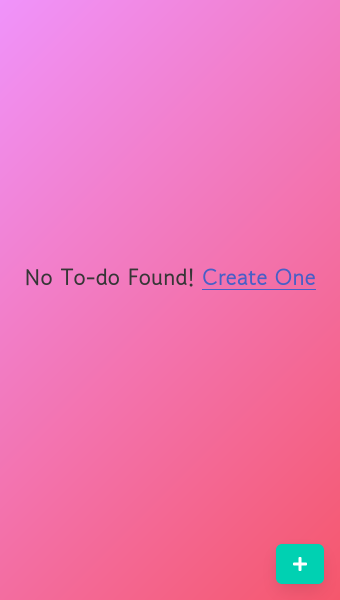
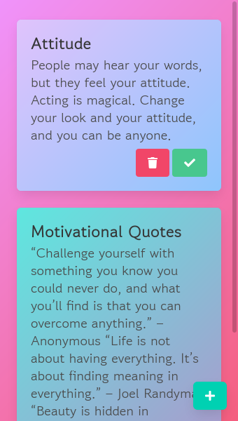
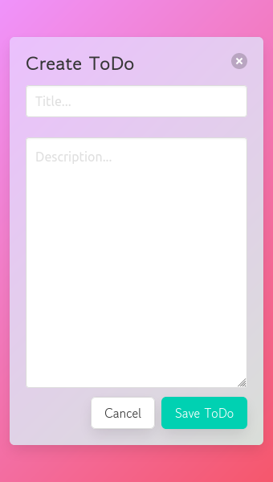

<!-- PROJECT LOGO -->
 

  

  <h3 align="center">ToDo App</h3>

  

    An awesome ToDo app made with React..!
     
    <a href="https://muhammed-rahif.github.io/ToDo-App/"><strong>Open website »</strong></a>
     
     
    <a href="https://github.com/Muhammed-Rahif/ToDo-App/">Github Link</a>
    ·
    <a href="https://github.com/Muhammed-Rahif/ToDo-App/issues/">Report Bug</a>
    ·
    <a href="https://github.com/Muhammed-Rahif/ToDo-App/pulls/">Contribute to Project</a>
  

## 📱️ Screenshots 

  
  
  

## ⛏️ Built Using 

- [React](https://reactjs.org/) - React is a free and open-source front-end JavaScript library for building user interfaces or UI components
- [React Spring](https://react-spring.io/) - React-Spring is a spring-physics based animation library that should cover most of your UI related animation needs
- [Moment Js](https://momentjs.com/) - Parse, validate, manipulate, and display dates and times

## ✍️ Authors 

- [@Muhammed-Rahif](https://github.com/Muhammed-Rahif) - Idea & Full work
